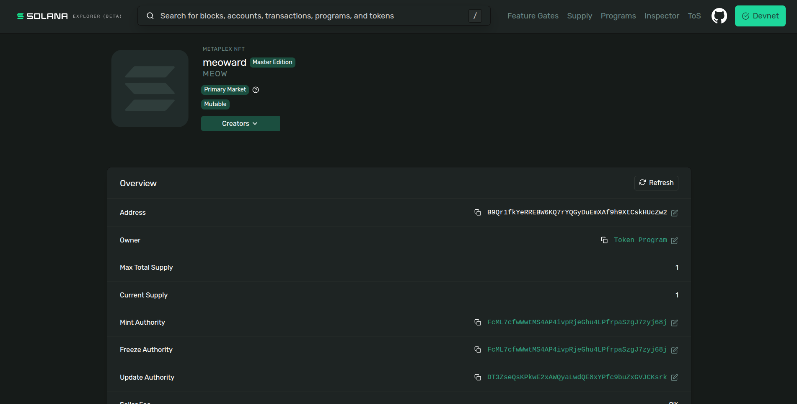

# NFT Mint & Swap – Solana Devnet

This project demonstrates minting an NFT on Solana devnet using Metaplex UMI and preparing it for peer-to-peer trading.

---

## NFT Screenshot

> Note: NFT images may not render in Phantom or Solana Explorer on devnet due to indexing limitations. Ownership and metadata are verified via transaction hashes and URIs.

---

## Minting Details

- **Mint Address**
  B9Qr1fkYeRREBW6KQ7rYQGyDuEmXAf9h9XtCskHUcZw2

- **Mint Transaction Hash**
  https://explorer.solana.com/tx/25jGtnQXGXytMsCqPHCLkyqNpRZ6PUpqrniMtNCKH4e8LrAhGhiHr445hAcSyKvPYwHcuw464ZAcA9yD1a26mTFX?cluster=devnet

- **Image URI**
  https://gateway.irys.xyz/8PGcq51kQS29L68coUUaQu2MfDuj5YCQKKEfdzd9kKxU

- **Metadata URI**
  https://gateway.irys.xyz/8BvXmjVY81GjJk8ZcSkUPhjnJ1hAuUpVRvcvBkVCSxhk

---

## NFT Trade (Swap)

- **NFT Sent Transaction Hash**
  https://solscan.io/tx/2yNGjjvBajLagaBeuQ1DjUuYGZdKz758UpaHhPG11FF36KsPLm521ZnLE4wSftbgYLUnHwsQFF5HkYuw4CyEdF7C?cluster=devnet

- **NFT Received Transaction Hash**
  https://solscan.io/tx/2i8zFRyFUH394qthfMZpesEvbjMh4FCcvjB5jLzZyxwBsAjQrDs4R3vWuW241j5sB4nbpSiqBtoCxc6fuq5Q1vf5?cluster=devnet

> The swap is intended to be performed via manual NFT transfers after coordinating with another participant on Discord, as specified in the assignment.

---

## Reflection

### Problems / Limitations

- NFT swaps require **trust**, as there is no atomic guarantee that both parties will complete the exchange.
- The process depends on **off-chain coordination** (Discord), which is inefficient and error-prone.
- Users must manually verify wallet addresses and transaction confirmations.
- Wallets and explorers provide **limited UX support on devnet**.

### Proposed Solution

A trustless solution would be an **escrow-based atomic swap smart contract**, where both NFTs are deposited before execution. The swap would only complete if both parties fulfill the conditions, otherwise assets would be returned to their original owners.

---

## Network

- Solana **Devnet**
