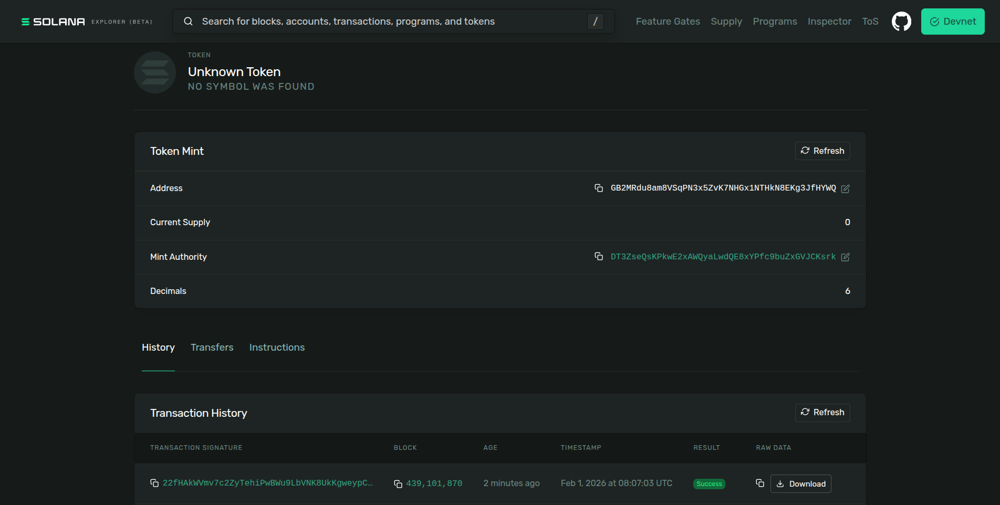
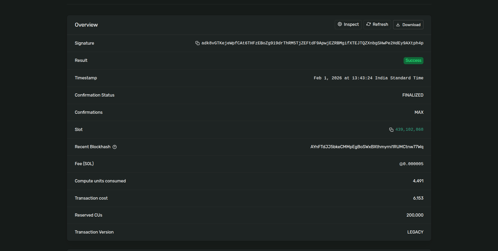

# Solana SPL Token Mint (Devnet)

This repository demonstrates how to **create and mint an SPL token** on the
**Solana Devnet** using TypeScript and `@solana/spl-token`.

---

## Token Details

- **Network:** Devnet
- **Decimals:** 6
- **Mint Address:**
  `GB2MRdu8am8VSqPN3x5ZvK7NHGx1NTHkN8EKg3JfHYWQ`

---

## Minting Transaction

- **Transaction Hash:**
  `adk8vGTKejeWpfCAt6THFzEBoZg919drThRM5TjZEFtdF9ApwjEZRBMgifXTEJTQZXnbgSHwPe2HdEy9AXtph4p`

- **Solana Explorer Link:**
  https://explorer.solana.com/tx/adk8vGTKejeWpfCAt6THFzEBoZg919drThRM5TjZEFtdF9ApwjEZRBMgifXTEJTQZXnbgSHwPe2HdEy9AXtph4p?cluster=devnet

---

## Token Screenshot



## Hash of the minting tx



---

## 🛠 How to Run

```bash
npm install
npx tsc
node spl_init.js
node spl_mint.js
